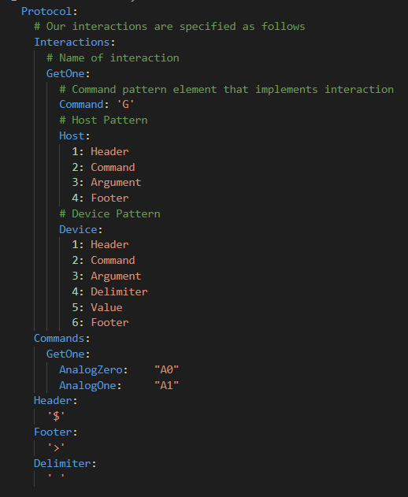

# uComs
###  
## Parser Module:
 - The meat of uComms, it parses commands from your embedded project.
 - Supports protocols which are strings when the uComs.parse() method is called

 # Protocol Description:
 ## Names:
 * **Pattern**: A pattern describes a set of characters/bytes/bits that make up a packet of data sent either from host to device or device to host
 * **Interaction**: An interaction is a set of pattern(s) usually with a host and a device pattern but also could just be one or the other.
 * **Command**: A command implements an Interaction, there can be many commands that are described by an interaction, you can get an analog value(interaction), or you can get analog pin 1's value(command)
 * **Argument**: When you have multiple implementations of a command, you specify where to put the part of the command which you specify for an implementation
 * **Value**: This is where the host or the device would input their own argument value
 

## FUTURE PLANS:
    Outline future plans as issues